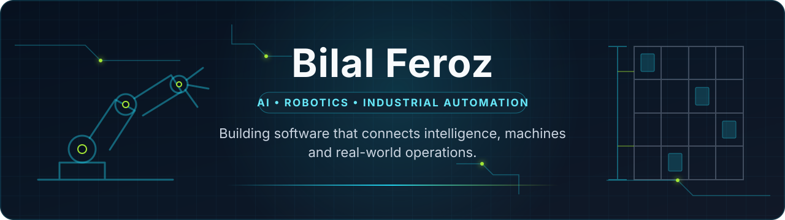

  

  
  
  
  
  

## Building intelligence into real-world systems

I build AI and automation systems that connect interfaces, data, machines, and real operations. I am a **Visiting Researcher at EDGE BRIDGE**, **CPO at [Kanban Studios](https://kanbanstudios.ae)**, and **Computer Science student at Al Ain University**.

## Current focus

- Practical AI agents and workflow automation with human review.
- Digital Twin and HMI concepts for machine state and control.
- Robotics, computer vision, and machine-interface systems.
- Sensors, edge devices, and interfaces shaped into deployable prototypes.

## What I build

- **AI & intelligent systems** — Agents, document intelligence, computer vision, and automation.
- **Robotics & industrial automation** — ASRS, ROS, RFID, edge devices, and machine integration.
- **Digital products** — Internal tools, operational dashboards, education technology, and prototypes.
- **Interfaces & visualisation** — HMIs, Digital Twins, real-time state, alerts, and control flows.

## How I approach systems

- Start with the operational workflow, constraints, and failure modes—not a feature list.
- Make machine state, decision evidence, and recovery paths visible to operators.
- Prototype quickly, validate the hardware boundary, and keep human review where AI affects decisions.

## Technology stack

**AI & backend**

**Frontend & mobile**

**Robotics & automation**

**Infrastructure & tools**

## Featured builds

### [TraceForge](https://github.com/bilal-feroz/TraceForge)

An evidence-first agent that load-tests Git changes, finds regressions in SigNoz telemetry, and verifies fixes before code ships. 
`Python` `FastAPI` `TypeScript` `Next.js` `OpenTelemetry`

### [Air Canvas](https://github.com/bilal-feroz/Air-Canvas)

A webcam-controlled spatial canvas with gesture input, editable vector strokes, and depth-aware 3D interaction for hands-free drawing. 
`Python` `MediaPipe` `OpenCV` `NumPy`

### [Digital Twin Manual](https://github.com/bilal-feroz/digital-twin-manual)

A touch-focused HMI for controlling a simulated arm and conveyors with clear position and direction feedback. 
`Svelte 5` `SvelteKit` `JavaScript` `Vite`

### [Excelerate Learning Platform](https://github.com/bilal-feroz/Excelerate-Internship)

A mobile learning platform for program discovery, enrollment, feedback, and progress tracking through a shared Material 3 system. 
`Flutter` `Dart` `Material 3` `JSON`

## Experience snapshot

- **EDGE BRIDGE — Visiting Researcher** · Jan 2026–Present · Applied automation, Digital Twins, HMIs, robotics, computer vision, and edge integration.
- **Kanban Studios — Chief Product Officer** · Jun 2026–Present · Product strategy, UX, technical planning, AI agents, and workflow tools.
- **EDGE BRIDGE — Intelligent Systems & Automation Trainee** · Sep–Dec 2025 · ASRS, sensors, machine state, hardware integration, and commissioning.
- **EDGE BRIDGE — Software Engineer Intern** · Aug–Sep 2025 · Operator interfaces, alerts, backend integration, and hardware testing.

## Competition highlights

- **1st** — Tamkeen 5.0 Hackathon
- **1st** — Replit × IEC Buildathon
- **2nd** — Safe AI Cup
- **2nd** — Emirates Agriculture Hackathon
- **3rd** — c0mpiled-2 UAE Hackathon
- **Finalist** — Global Build Challenge

## GitHub activity

  <picture>
    <source media="(prefers-color-scheme: dark)" srcset="https://github-readme-stats-fast.vercel.app/api?username=bilal-feroz&amp;show_icons=true&amp;hide_rank=true&amp;hide_border=true&amp;theme=github_dark" />
    
  </picture>
  <picture>
    <source media="(prefers-color-scheme: dark)" srcset="https://github-readme-stats-fast.vercel.app/api/top-langs/?username=bilal-feroz&amp;layout=compact&amp;hide_border=true&amp;theme=github_dark" />
    
  </picture>

  <picture>
    <source media="(prefers-color-scheme: dark)" srcset="https://raw.githubusercontent.com/bilal-feroz/bilal-feroz/output/github-contribution-grid-snake-dark.svg" />
    
  </picture>

## Education

**BSc Computer Science** · Al Ain University

## Let’s connect

Interested in systems where AI, software, and machines must work together reliably.

[LinkedIn](https://www.linkedin.com/in/bilal-feroz-552b7830a) · [Email](mailto:bilalfk.viii@gmail.com) · [Kanban Studios](https://kanbanstudios.ae) · [GitHub](https://github.com/bilal-feroz)
