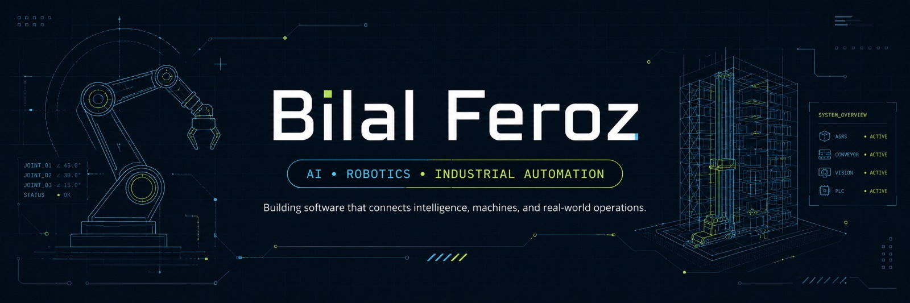

  

  
  
  
  
  

# Building practical systems across AI, robotics & automation

I build systems where **AI, software, machines, sensors, and real operational workflows have to work together reliably**.

I am a **Visiting Researcher at EDGE BRIDGE**, **Chief Product Officer at [Kanban Studios](https://kanbanstudios.ae)**, and currently completing my **BSc in Computer Science at Al Ain University**.

My work spans industrial automation, Digital Twins, HMIs, robotics, computer vision, agentic AI, backend systems, observability, reliability engineering, and rapid product prototyping.

## What I am working on

- **Agentic AI** systems with evidence, policy logic, and human review.
- **Industrial automation** connecting software to machines, sensors, and operators.
- **Digital Twins & HMIs** for machine state, monitoring, control, and diagnostics.
- **Robotics & computer vision** for real-world perception and interaction.
- **Reliability engineering** using telemetry, load testing, traces, logs, and automated verification.
- **Full-stack products** that move from prototype to usable operational software.

## What I build

### AI & intelligent systems
Agentic workflows, RAG systems, knowledge graphs, document intelligence, decision-support systems, computer vision, and AI-assisted automation.

### Robotics & industrial automation
ASRS systems, ROS integrations, RFID workflows, Digital Twins, HMI interfaces, edge devices, machine-state representation, and hardware-software integration.

### Full-stack & operational software
Dashboards, internal tools, APIs, workflow engines, mobile applications, monitoring systems, and production-focused prototypes.

### Reliability & observability
Load testing, regression detection, telemetry analysis, traces, logs, performance thresholds, automated validation, and deployment safety.

## Engineering principles

- Start with the **real workflow and failure modes**, not the feature list.
- Make system state, AI reasoning, evidence, and recovery paths visible.
- Treat AI as part of a larger system, not the entire product.
- Keep humans in the loop where automated decisions have consequences.
- Prototype quickly, but validate against actual operational constraints.
- Measure performance instead of assuming something works.
- Prefer systems that are explainable, testable, observable, and recoverable.

## Technology stack

### AI, backend & data

`RAG` `Qdrant` `Embeddings` `Hybrid Retrieval` `Knowledge Graphs` `Agentic AI` `MCP` `XGBoost` `PyTorch`

### Frontend & mobile

### Robotics, vision & automation

`RFID` `Node-RED` `HMI` `Digital Twins` `ASRS` `Computer Vision` `YOLO` `Machine Integration`

### Reliability & infrastructure

`OpenTelemetry` `SigNoz` `k6` `autocannon` `Load Testing` `Performance Regression Analysis`

# Featured builds

## 🏥 [CaseReady AI](https://github.com/bilal-feroz/caseready-ai)

**2nd Place Nationally — AIMed AI Builders Summit 2026**

A surgical operations platform that helps hospitals identify cases at risk, detect readiness blockers, and recover endangered operating-room capacity through human-approved decision support.

`AI` `Healthcare` `Decision Support` `Workflow Automation` `Human-in-the-Loop`

---

## 🔎 [TraceForge](https://github.com/bilal-feroz/TraceForge)

An AI reliability agent that determines whether a code change is actually safe before it reaches production.

It runs identical load tests against old and new versions, investigates traces and logs through SigNoz, detects regressions, proposes focused fixes, and verifies them in an isolated environment.

In one test, TraceForge detected that **94.55% of requests were failing** even though the new version initially appeared faster.

It also detected a silent regression where errors stayed at **0%**, while P95 latency increased from **103.91 ms to 2,376.92 ms**.

`Python` `FastAPI` `Next.js` `OpenTelemetry` `SigNoz` `MCP` `k6`

---

## ⚙️ ScaleProof

An automated infrastructure-testing system built during a Zerops challenge.

ScaleProof sends real traffic to an application, changes infrastructure configuration through the Zerops API, reruns the same tests, and determines the smallest configuration capable of meeting defined performance targets.

One experiment improved P95 latency from **496 ms to 265 ms** by moving from 1 CPU to 2 CPUs.

Another detected that adding a container made performance approximately **2.5× worse**, rejected the configuration, and automatically rolled it back.

`Next.js` `Fastify` `Go` `PostgreSQL` `TypeScript` `autocannon` `Zerops`

---

## 🧠 Aletheia

An AI research assistant built around an unusual problem:

**What happens when information the AI previously learned becomes wrong?**

Aletheia uses knowledge-graph concepts to detect conflicting sources, identify retracted information, update its knowledge, and regenerate answers using trusted evidence.

Instead of only learning more information, it can also **unlearn invalidated knowledge**.

`AI Memory` `Knowledge Graphs` `Cognee` `Evidence Tracking` `AI Agents`

---

## ✋ [Air Canvas](https://github.com/bilal-feroz/Air-Canvas)

A webcam-controlled spatial canvas with gesture input, editable vector strokes, and depth-aware interaction for hands-free drawing.

`Python` `MediaPipe` `OpenCV` `NumPy`

---

## 🏭 [Digital Twin Manual](https://github.com/bilal-feroz/digital-twin-manual)

A touch-focused industrial HMI for controlling a simulated robotic arm and conveyor system with clear position, movement, direction, and state feedback.

`Svelte 5` `SvelteKit` `JavaScript` `Vite` `HMI` `Digital Twin`

---

## 📱 [Excelerate Learning Platform](https://github.com/bilal-feroz/Excelerate-Internship)

A Flutter-based learning platform developed during my Excelerate internship.

I led project management and technical integration across the team, managed GitHub workflow across **17 merged pull requests**, built the JSON data layer, coordinated feature integration, and supported final QA and release preparation.

`Flutter` `Dart` `Material 3` `JSON` `GitHub`

---

## ♻️ ReLoop Vision

A browser-based industrial waste-sorting simulation developed during a **Robotics, AI & Industry 4.0 Innovation Lab Workshop**.

The system combines multiple sensor inputs, confidence scoring, edge decision logic, and safety overrides to route recyclable materials while isolating hazardous or uncertain items.

`Industrial AI` `Sensors` `Edge Logic` `Automation` `Safety Systems`

# Experience

### EDGE BRIDGE — Visiting Researcher
**Jan 2026 – Present**

Applied research and prototype development across industrial automation, ASRS systems, Digital Twins, HMIs, robotics, computer vision, machine interfaces, and Industry 4.0/5.0 technologies.

### Kanban Studios — Chief Product Officer
**Jun 2026 – Present**

Product direction and technical planning for AI-powered software, automation systems, internal tools, AI agents, document intelligence, dashboards, and workflow platforms.

### Excelerate — Project Manager / Flutter Development Intern
**Jul 2026**

Led project management and technical integration for a multi-member Flutter development team, including architecture, GitHub workflows, feature integration, QA, documentation, and release preparation.

### EDGE BRIDGE — Intelligent Systems & Automation Trainee
**Sep 2025 – Dec 2025**

Worked across ASRS development, HMI systems, Digital Twin prototyping, RFID/backend integration, ROS Bridge support, hardware testing, commissioning, computer vision, security, and system troubleshooting.

Contributed to resolving **50+ tracked software and system issues**.

### EDGE BRIDGE — Software Engineer Intern
**Aug 2025 – Sep 2025**

Worked on robotics, industrial automation, Boston Dynamics Spot exploration, system design, ASRS planning, and hardware-software integration.

# Competition & innovation highlights

| Result | Competition / Event | Project |
|---|---|---|
| 🥇 **1st Place** | Tamkeen 5.0 Hackathon by G42 | Agentic Refund Intelligence |
| 🥇 **1st Place** | Replit × IEC Buildathon | Starkz AI |
| 🥈 **2nd Place Nationally** | AIMed AI Builders Summit 2026 | CaseReady AI |
| 🥈 **2nd Place** | Safe AI Cup 2026 | Generative AI / Education |
| 🥈 **2nd Place** | Emirates Agriculture Hackathon | SooqRoot |
| 🥉 **3rd Place** | c0mpiled-2 UAE Hackathon | DeedFlow |
| **6th / 26 Teams** | Abu Dhabi AI PropTech Challenge | Reach |
| **Finalist** | Global Build Challenge | Common Ground |
| **Finalist** | EDGE LIF NextGen Industry Challenge | FalconPatrol AI |
| **Top 170 / 4,710** | Create Apps Championship | XPBridge |

## Selected competition projects

- **Agentic Refund Intelligence** — auditable AI workflow for refund and payment-dispute investigation.
- **Starkz AI** — AI safety assistant for outdoor workers operating in extreme UAE heat.
- **CaseReady AI** — operating-room readiness and surgical capacity decision support.
- **SooqRoot** — agricultural coordination platform connecting smaller farms into a unified supply network.
- **Reach** — AI-powered urban siting and accessibility analysis.
- **DeedFlow** — compliance-first workflow engine for fractional and tokenized UAE real estate.
- **FalconPatrol AI** — Boston Dynamics Spot-based robotic surveillance concept.
- **Common Ground** — audience-aware AI communication and message adaptation.

# Industrial engineering work

At EDGE BRIDGE, I have worked on systems involving:

- ASRS workflows
- HMI development
- Digital Twin visualisation
- RFID/backend integration
- ROS Bridge integration
- Sensor and machine-state workflows
- Conveyor and gantry testing
- Hardware testing and commissioning
- Authentication and access-control workflows
- Mutual TLS integration
- Computer vision
- XGBoost-based forecasting
- Kiosk reliability and AutoStart workflows
- Deployment and handover documentation

I also presented EDGE BRIDGE automation systems at **Make it in the Emirates 2026**, demonstrating ASRS, HMI, and Digital Twin capabilities to visitors and industry stakeholders.

# GitHub activity

  <picture>
    <source media="(prefers-color-scheme: dark)" srcset="https://github-readme-stats-fast.vercel.app/api?username=bilal-feroz&amp;show_icons=true&amp;hide_rank=true&amp;hide_border=true&amp;theme=github_dark" />
    
  </picture>

  <picture>
    <source media="(prefers-color-scheme: dark)" srcset="https://github-readme-stats-fast.vercel.app/api/top-langs/?username=bilal-feroz&amp;layout=compact&amp;hide_border=true&amp;theme=github_dark" />
    
  </picture>

  <picture>
    <source media="(prefers-color-scheme: dark)" srcset="https://raw.githubusercontent.com/bilal-feroz/bilal-feroz/output/github-contribution-grid-snake-dark.svg" />
    
  </picture>

# Education

### Al Ain University
**BSc Computer Science · 2023 – Present**

Areas of study include algorithms, object-oriented programming, databases, web development, artificial intelligence, computer graphics, systems analysis, and software engineering.

# Beyond engineering

Outside of tech, I play football and enjoy drawing and painting.

# Let's connect

I am especially interested in systems where **AI, software, robotics, and physical operations have to work together reliably**.

[LinkedIn](https://www.linkedin.com/in/bilal-ferozz/) ·
[Email](mailto:bilalfk.viii@gmail.com) ·
[Kanban Studios](https://kanbanstudios.ae) ·
[GitHub](https://github.com/bilal-feroz)
