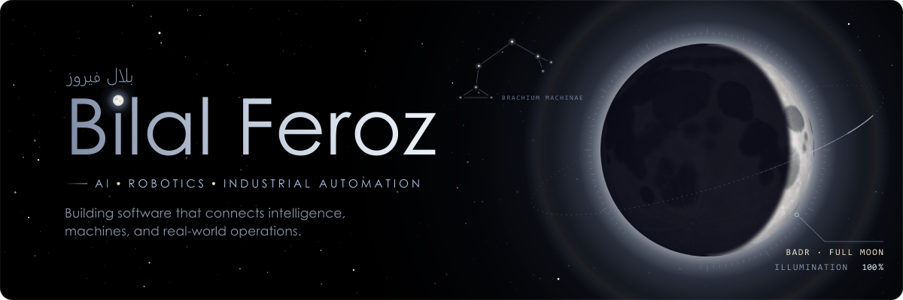
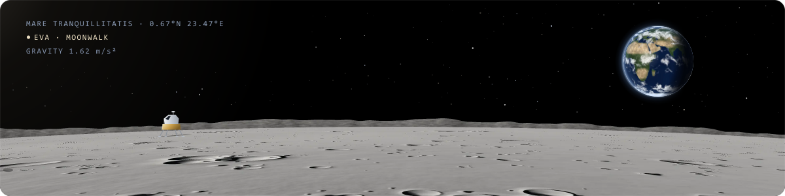
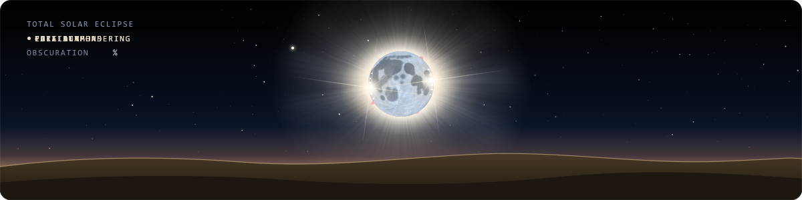

  

  
  
  
  

#  Building intelligent systems for the real world

I build systems where **AI, software, machines, sensors, and real operational workflows have to work together reliably**.

Currently a **Visiting Researcher at EDGE BRIDGE**, **Chief Product Officer at [Kanban Studios](https://kanbanstudios.ae)**, and **Computer Science student at Al Ain University**.

My work sits mainly across **AI systems, robotics, industrial automation, Digital Twins, and reliability engineering**.

##  Current focus

- Building AI systems that reason from **evidence, system state, and policy**.
- Connecting software with **robots, machines, sensors, and operators**.
- Developing **Digital Twins and HMIs** for monitoring and control.
- Testing whether systems remain reliable when conditions actually change.

##  What I build

### AI systems
Agents, decision-support tools, RAG pipelines, knowledge systems, and computer vision.

### Robotics & automation
ROS integrations, Digital Twins, HMIs, RFID workflows, machine interfaces, and edge systems.

### Reliable software
APIs, internal tools, dashboards, monitoring systems, automated testing, and production-focused prototypes.

  

##  Engineering principles

- Start with the **real workflow and failure modes**, not the feature list.
- Treat AI as part of a larger system, not the entire product.
- Keep humans involved when automated decisions have consequences.
- Measure performance instead of assuming something works.
- Build systems that are **explainable, observable, testable, and recoverable**.

##  Technology

### AI & backend

`RAG` `Qdrant` `Knowledge Graphs` `MCP` `Agentic AI`

### Frontend & mobile

### Robotics & automation

`RFID` `Node-RED` `HMI` `Digital Twins` `ASRS` `Computer Vision`

### Infrastructure & reliability

`OpenTelemetry` `SigNoz` `k6` `Load Testing`

#  Featured builds

## [TraceForge](https://github.com/bilal-feroz/TraceForge)

An **AI reliability agent** that determines whether a code change is actually safe before production.

It compares old and new versions under identical load, investigates traces and logs through SigNoz, identifies regressions, proposes focused fixes, and verifies them in isolation.

Detected one failure where **94.55% of requests were breaking**, and another where errors remained at **0%** while P95 latency jumped from **103.91 ms to 2,376.92 ms**.

`FastAPI` `Next.js` `OpenTelemetry` `SigNoz` `MCP` `k6`

---

## [CaseReady AI](https://github.com/bilal-feroz/caseready-ai)

**2nd Place Nationally — AIMed AI Builders Summit 2026**

A surgical operations platform that detects cases at risk of cancellation, identifies readiness blockers, and helps staff recover operating-room capacity through human-approved decision support.

`AI` `Healthcare` `Decision Support` `Human-in-the-Loop`

---

## ScaleProof

An automated infrastructure-testing system that finds the **smallest configuration capable of meeting defined performance targets**.

One experiment improved P95 latency from **496 ms to 265 ms**. Another detected that adding a container made performance roughly **2.5× worse** and automatically rejected the configuration.

`Next.js` `Go` `PostgreSQL` `TypeScript` `autocannon`

---

## Aletheia

**What happens when information an AI previously learned becomes wrong?**

Aletheia detects conflicting or retracted information, updates its knowledge graph, and regenerates answers from trusted evidence.

Instead of only learning more information, it can also **unlearn invalidated knowledge**.

`Knowledge Graphs` `AI Memory` `Evidence Tracking` `AI Agents`

---

## [Air Canvas](https://github.com/bilal-feroz/Air-Canvas)

A webcam-controlled spatial canvas with gesture input, editable vector strokes, and depth-aware interaction for hands-free drawing.

`Python` `MediaPipe` `OpenCV`

---

## [Digital Twin Manual](https://github.com/bilal-feroz/digital-twin-manual)

A touch-focused industrial HMI for controlling a simulated robotic arm and conveyor system with live position, movement, direction, and machine-state feedback.

`Svelte` `HMI` `Digital Twin`

#  Experience

### EDGE BRIDGE — Visiting Researcher
**Jan 2026 – Present**

Applied R&D across **industrial automation, Digital Twins, HMIs, robotics, computer vision, and intelligent machine systems**.

### Kanban Studios — Chief Product Officer
**Jun 2026 – Present**

Product direction and technical planning for AI products, automation systems, internal tools, and intelligent workflows.

### Excelerate — Project Manager / Flutter Development Intern
**Jul 2026**

Led project management and technical integration for a multi-member Flutter development team across architecture, GitHub workflow, integration, QA, and release preparation.

### EDGE BRIDGE — Intelligent Systems & Automation Trainee
**Sep 2025 – Dec 2025**

Worked on ASRS, RFID/backend integration, ROS systems, Digital Twins, hardware commissioning, computer vision, and system reliability.

Contributed to resolving **50+ tracked software and system issues**.

### EDGE BRIDGE — Software Engineer Intern
**Aug 2025 – Sep 2025**

Worked on robotics, industrial automation, Boston Dynamics Spot exploration, ASRS planning, and hardware-software integration.

  

#  Competition highlights

| Result | Competition / Event | Project |
|---|---|---|
| **1st Place** | Tamkeen 5.0 Hackathon by G42 | Agentic Refund Intelligence |
| **1st Place** | Replit × IEC Buildathon | Starkz AI |
| **2nd Place Nationally** | AIMed AI Builders Summit 2026 | CaseReady AI |
| **2nd Place** | Safe AI Cup 2026 | Generative AI / Education |
| **2nd Place** | Emirates Agriculture Hackathon | SooqRoot |
| **3rd Place** | c0mpiled-2 UAE Hackathon | DeedFlow |
| **6th / 26 Teams** | Abu Dhabi AI PropTech Challenge | Reach |
| **Finalist** | Global Build Challenge | Common Ground |
| **Finalist** | EDGE LIF NextGen Industry Challenge | FalconPatrol AI |
| **Top 170 / 4,710** | Create Apps Championship | XPBridge |

A few of these projects explored **AI safety, healthcare operations, agriculture, real estate, robotics, and urban intelligence**.

#  Industrial systems

At EDGE BRIDGE, I have worked directly with:

`ASRS` `HMI` `Digital Twins` `RFID` `ROS` `Machine Integration` `Computer Vision` `mTLS` `Hardware Commissioning`

I also presented EDGE BRIDGE automation systems at **Make it in the Emirates 2026**, demonstrating ASRS, HMI, and Digital Twin capabilities to visitors and industry stakeholders.

#  GitHub activity

  

  
  

  <picture>
    <source media="(prefers-color-scheme: dark)" srcset="https://raw.githubusercontent.com/bilal-feroz/bilal-feroz/output/github-contribution-grid-snake-dark.svg" />
    
  </picture>

#  Education

### Al Ain University
**BSc Computer Science · 2023 – Present**

#  Beyond engineering

Outside of tech, I play football and enjoy drawing and painting.

#  Let's connect

I am interested in building **intelligent systems that have to survive contact with the real world**.

[LinkedIn](https://www.linkedin.com/in/bilal-ferozz/) ·
[Email](mailto:bilalfk.viii@gmail.com) ·
[Kanban Studios](https://kanbanstudios.ae) ·
[GitHub](https://github.com/bilal-feroz)
